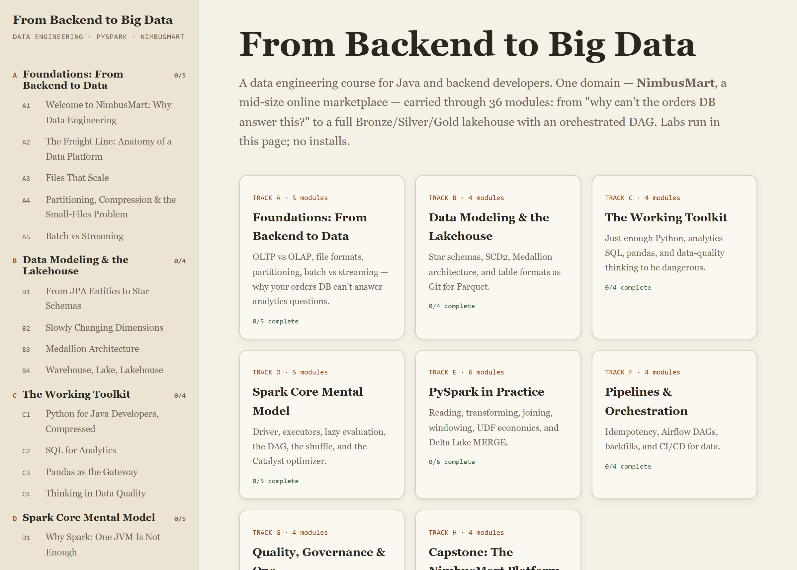
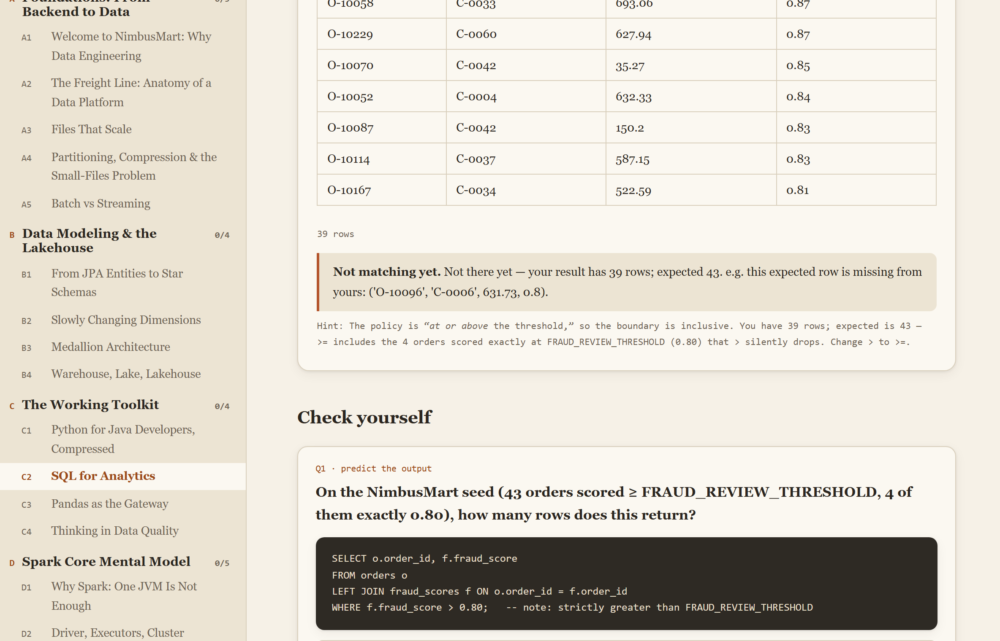
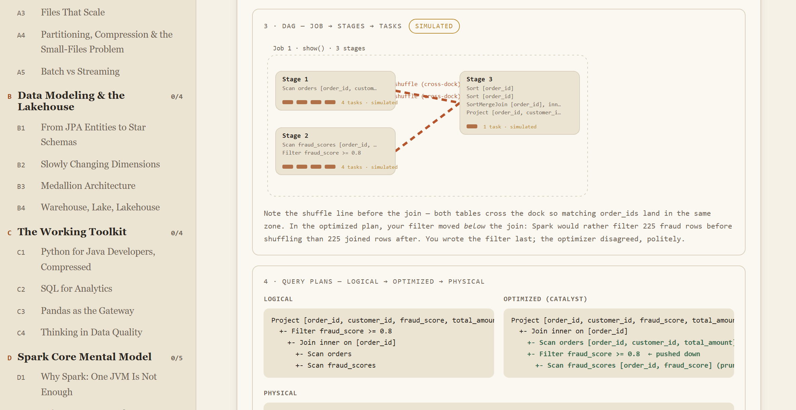
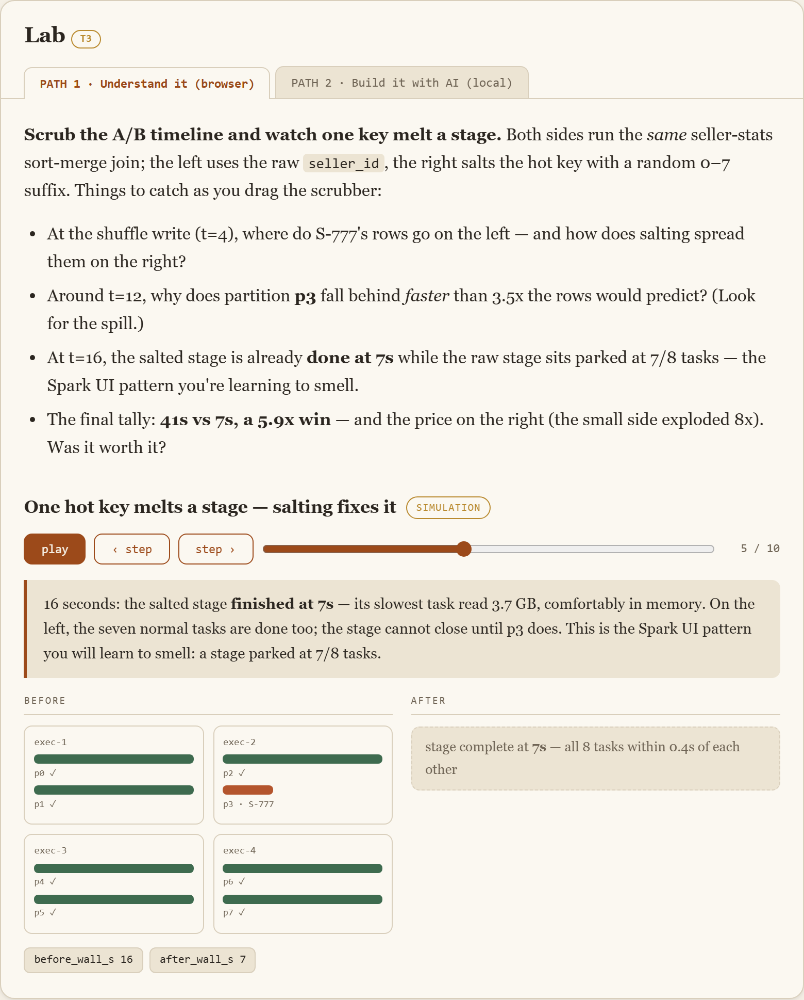
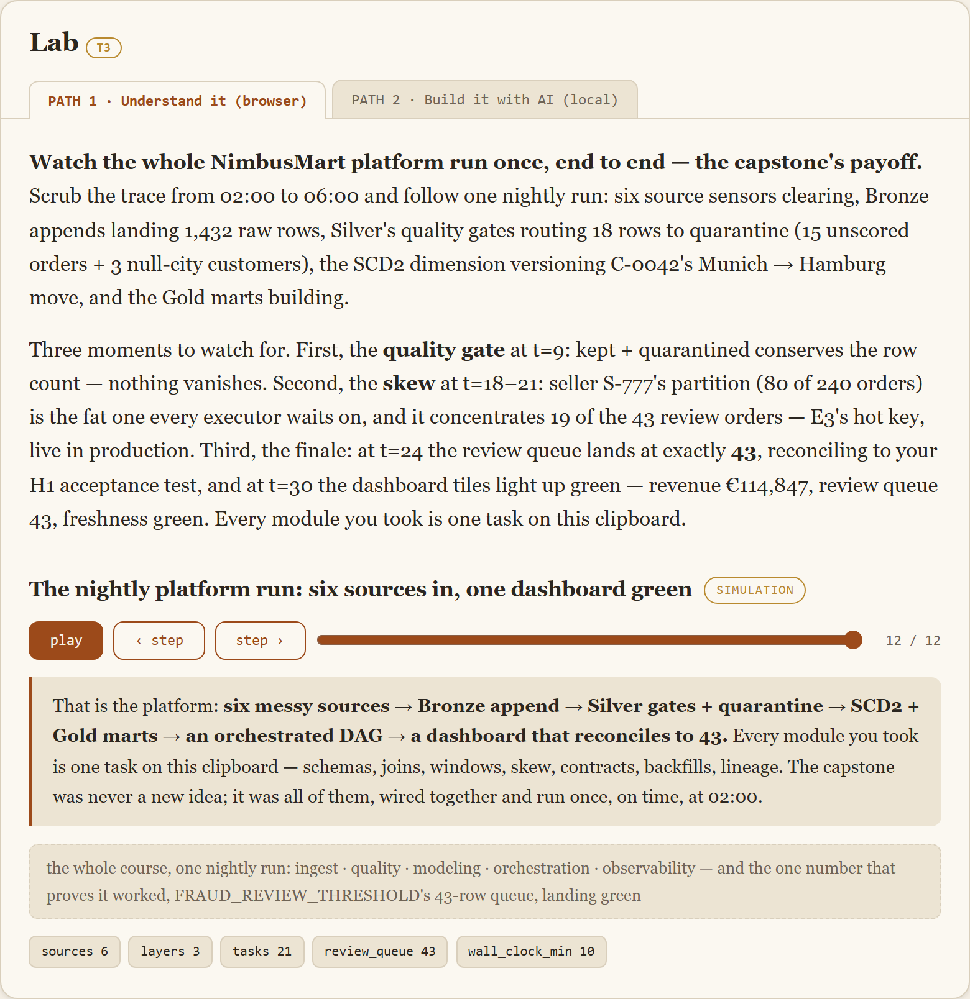

# From Backend to Big Data — Data Engineering with PySpark

A browser-based, install-free course that takes **Java / backend developers** into data
engineering. One domain — **NimbusMart**, a mid-size online marketplace — is carried
through **36 modules across 8 tracks**, from "why can't the orders database answer this?"
to a full Bronze/Silver/Gold lakehouse with an orchestrated DAG.

The entire course is a **single self-contained file**: [`player/index.html`](player/index.html).
No build step to *read* it, no server, no dependencies. Just open it.



```
# Windows
start player\index.html
# macOS
open player/index.html
# Linux
xdg-open player/index.html
```

Progress (completed modules, light/dark theme) is saved in your browser's local storage.

---

## What's inside

**8 tracks · 36 modules**, each with a NimbusMart cold open, a recurring *Freight Line*
warehouse analogy, a `☕ For the Java Dev` bridge (Spark ↔ Streams, Catalyst ↔ the JIT,
Delta MERGE ↔ JPA upsert…), two lab paths, verified check questions, and a production
war story.

| Track | Theme |
|-------|-------|
| **A** | Foundations: OLTP vs OLAP, file formats, partitioning, batch vs streaming |
| **B** | Data modeling & the lakehouse: star schemas, SCD2, Medallion, table formats |
| **C** | The working toolkit: Python, analytics SQL, pandas, data quality |
| **D** | Spark core mental model: driver/executors, lazy eval, the DAG, Catalyst |
| **E** | PySpark in practice: reads, transforms, joins, windows, UDFs, Delta |
| **F** | Pipelines & orchestration: idempotency, Airflow, backfills, CI/CD |
| **G** | Quality, governance & ops: contracts, validation gates, lineage, tuning |
| **H** | Capstone: the NimbusMart platform, six sources → dashboard |

**The spine:** `FRAUD_REVIEW_THRESHOLD = 0.80`. Orders scored below it auto-fulfill; at or
above it they land in a human review queue. That one number — and the **43-row review
queue** it defines on the seed data — recurs from module A1 through the capstone, in
deeper contexts each time.

### Dual-path labs

Every module has two ways to practice:

- **Path 1 — Understand it (browser):** interactive, zero setup, runs in the page.
- **Path 2 — Build it with AI (local):** a copy-paste [Claude Code](https://claude.com/claude-code)
  prompt that scaffolds the *real* equivalent locally — a venv, `pip install pyspark`, a
  deterministic NimbusMart data generator, the exercise, and a pytest that proves the result.

### Three lab tiers — real where it's cheap, honest simulation where it isn't

| Tier | Engine | What it does |
|------|--------|--------------|
| **T1** | `sqlrunner.js` / Pyodide | **Real execution.** A hand-rolled SQL engine (CTEs, joins, window functions) and Pyodide/pandas run actual queries over the seed data, with an expected-result diff. |
| **T2** | `sparksim.js` | **SparkSim.** A teaching subset of the DataFrame API whose real product is the visualization: a lazy-evaluation ribbon, a job→stage→task **DAG** with shuffle boundaries, and logical→optimized→physical **plans** showing predicate pushdown and projection pruning live. Results are real; parallelism and timings are badged `simulated`. |
| **T3** | `traceplayer.js` | **Scripted traces.** For cluster-scale behavior no browser can honestly run — skew meltdowns, small-files explosions, backfills, the UDF serialization tax, the whole-platform finale. Authored, deterministic, play/pause/scrub, badged `simulation`. |

The one permitted network call is Pyodide's runtime, lazy-loaded only when a Python lab is
opened, with a graceful offline fallback. Nothing else touches the network.

---

## Modules

All 36 modules, with the lab tier and engine each uses (**T1** real execution · **T2**
SparkSim · **T3** scripted trace). Every module also carries the other tier's ideas in its
concept sections — the lab is just where you practice one of them.

<details>
<summary><strong>Show all 36 modules</strong></summary>

**Track A — Foundations: From Backend to Data**

| Module | Title | Lab |
|:------:|-------|-----|
| A1 | Welcome to NimbusMart: Why Data Engineering | T3 · trace |
| A2 | The Freight Line: Anatomy of a Data Platform | T3 · trace |
| A3 | Files That Scale | T2 · SparkSim |
| A4 | Partitioning, Compression &amp; the Small-Files Problem | T3 · trace |
| A5 | Batch vs Streaming | T3 · trace |

**Track B — Data Modeling &amp; the Lakehouse**

| Module | Title | Lab |
|:------:|-------|-----|
| B1 | From JPA Entities to Star Schemas | T1 · SQL |
| B2 | Slowly Changing Dimensions | T1 · SQL |
| B3 | Medallion Architecture | T3 · trace |
| B4 | Warehouse, Lake, Lakehouse | T3 · trace |

**Track C — The Working Toolkit**

| Module | Title | Lab |
|:------:|-------|-----|
| C1 | Python for Java Developers, Compressed | T1 · Pyodide |
| C2 | SQL for Analytics | T1 · SQL |
| C3 | Pandas as the Gateway | T1 · Pyodide |
| C4 | Thinking in Data Quality | T1 · SQL |

**Track D — Spark Core Mental Model**

| Module | Title | Lab |
|:------:|-------|-----|
| D1 | Why Spark: One JVM Is Not Enough | T3 · trace |
| D2 | Driver, Executors, Cluster Managers | T2 · SparkSim |
| D3 | DataFrames &amp; Lazy Evaluation | T2 · SparkSim |
| D4 | Jobs, Stages, Tasks &amp; the Shuffle | T2 · SparkSim |
| D5 | Catalyst &amp; Tungsten | T2 · SparkSim |

**Track E — PySpark in Practice**

| Module | Title | Lab |
|:------:|-------|-----|
| E1 | Reading &amp; Writing at Scale | T2 · SparkSim |
| E2 | Transformations Deep-Dive | T2 · SparkSim |
| E3 | Joins: Broadcast, Sort-Merge &amp; Skew | T3 · trace |
| E4 | Window Functions in Spark | T2 · SparkSim |
| E5 | UDFs vs Built-ins | T3 · trace |
| E6 | Incremental Processing &amp; Delta Lake | T2 · SparkSim |

**Track F — Pipelines &amp; Orchestration**

| Module | Title | Lab |
|:------:|-------|-----|
| F1 | From Script to Pipeline | T2 · SparkSim |
| F2 | Airflow DAGs | T3 · trace |
| F3 | Backfills, Catch-up &amp; SLAs | T3 · trace |
| F4 | CI/CD for Data Pipelines | T3 · trace |

**Track G — Quality, Governance &amp; Ops**

| Module | Title | Lab |
|:------:|-------|-----|
| G1 | Data Contracts &amp; Schema Evolution | T1 · SQL |
| G2 | Validation Gates | T2 · SparkSim |
| G3 | Lineage, Cataloging &amp; Observability | T3 · trace |
| G4 | Performance &amp; Cost Tuning Basics | T2 · SparkSim |

**Track H — Capstone: The NimbusMart Platform**

| Module | Title | Lab |
|:------:|-------|-----|
| H1 | Capstone Brief: The NimbusMart Platform | T1 · SQL |
| H2 | Build Bronze → Silver | T2 · SparkSim |
| H3 | Build Gold | T2 · SparkSim |
| H4 | Orchestrate, Document, Demo | T3 · trace |

</details>

---

## Gallery

The player and every lab tier, running in the browser (screenshots captured from
`player/index.html`):

<table>
<tr>
<td colspan="2">

<br><em><strong>The player</strong> — the single-file course: sidebar navigation across all 8 tracks and 36 modules, warm-paper design system with a dark-mode variant.</em>
</td>
</tr>
<tr>
<td width="50%">

<br><em><strong>T1 · SQL</strong> — real in-browser execution. The starter's <code>&gt;</code> returns 39 rows; the diff explains why the inclusive boundary needs <code>&gt;=</code> to reach 43.</em>
</td>
<td width="50%">

<br><em><strong>T2 · SparkSim</strong> — the DAG (red cross-dock shuffle lines) and the logical→optimized→physical plans, with the filter pushed down below the join.</em>
</td>
</tr>
<tr>
<td width="50%">

<br><em><strong>T3 · Skew trace (E3)</strong> — seller S-777's hot key melts one partition (the red bar) while salting spreads it evenly. Before/after scrubber.</em>
</td>
<td width="50%">

<br><em><strong>T3 · Capstone finale (H4)</strong> — the whole NimbusMart platform runs once, six sources to a green dashboard, review queue reconciling to 43.</em>
</td>
</tr>
</table>

---

## Repository layout

```
player/index.html        THE deliverable — single-file course player (zero runtime deps)
content/modules/         one .js fragment per module (A1.js … H4.js)
engine/                  sqlrunner.js, sparksim.js, traceplayer.js, pyrunner.js
engine/traces/           14 authored T3 trace timelines (+ schema.json)
data/nimbusmart/         deterministic seed generator (generate.py → seed.js)
scripts/                 inject.py, validate.py, build.py (+ build.ps1), qa.js, smoke_dom.js
docs/                    blueprint, authoring workflow, lab-engine spec, engine contract, PROGRESS.md
.claude/commands/        authoring slash commands
CLAUDE.md                authoring engine instructions
```

The player is assembled from parts: [`scripts/build.py`](scripts/build.py) splices the seed
data, the four engines, the traces, and all 36 module fragments into `player/index.html`
between comment-fenced regions. **Content is never hand-edited in the player** — you edit a
fragment and re-inject.

---

## Working with the source

Requires **Python 3.10+** and **Node 18+**. Lab-engine QA additionally uses `jsdom` and
`playwright` (dev-only; the shipped player needs neither).

```bash
python data/nimbusmart/generate.py     # regenerate the deterministic seed (seed 42)
python scripts/validate.py --all --final   # schema + threshold-discipline check on all modules
python scripts/build.py                # assemble player, node --check gate, refresh PROGRESS.md
node scripts/qa.js                     # mount every lab in a headless DOM; check trace refs, dup cold-opens
```

Authoring one module follows a fixed rhythm (see [`docs/02-AUTHORING-WORKFLOW.md`](docs/02-AUTHORING-WORKFLOW.md)):
scaffold the fragment → write the lab against the engine contract
([`docs/04-ENGINE-CONTRACT.md`](docs/04-ENGINE-CONTRACT.md)) → `validate` → `inject` → `build`.
`validate.py` enforces the schema: exactly one Freight Line analogy and one Java bridge per
module, both lab paths present, 3–5 checks, valid lab tier, and that `FRAUD_REVIEW_THRESHOLD`
is always a named constant (never a bare `0.80`).

### Verified facts the labs depend on

The seed generator (`random.seed(42)`) produces a stable world so expected outputs never drift:

- **240 orders**, fraud scores for **225** of them (15 unscored)
- exactly **43 orders** at or above `FRAUD_REVIEW_THRESHOLD`, **4** of them scored *exactly* 0.80
  (the inclusive-boundary lesson)
- seller **S-777** owns **80/240** orders — the skew hot key
- customer **C-0042** moved Paris → Munich → Hamburg mid-quarter — the SCD2 poster child

---

## Design system

Fraunces for display, JetBrains Mono for code and data, a warm-paper palette with a full
dark-mode variant. All diagrams are inline SVG using CSS custom properties, so they recolor
correctly in both themes.

---

*Authored with [Claude Code](https://claude.com/claude-code).*
